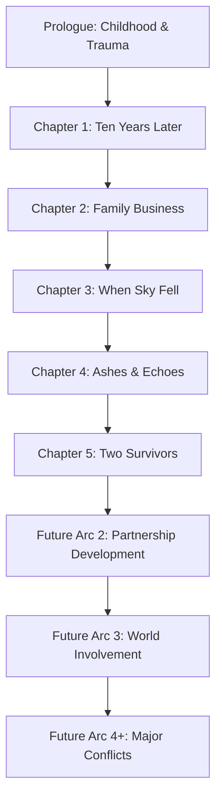

# Design Document

## Overview

This Wuthering Waves fanfiction follows Caspian, a reincarnated office worker who retains his past life memories and grows up in the same village as Phrolova. The story explores themes of trauma, survival, and the tension between wanting ordinary life and being drawn into extraordinary circumstances through a Korean webnovel style with heavy internal monologue and self-deprecating humor.

**Genre**: Isekai Fantasy with Survival/Paranoia themes  
**Style**: Korean Webnovel (First-person, internal monologue heavy, balanced thought/talk/story composition)  
**Target**: Arc 1 (Prologue + 11-12 chapters total, ~15,000-20,000 words)  
**Timeline**: ~20-30 years before main WuWa events, 500 years after initial Lament  
**World Context**: 10k regional laments + 5 global laments (world is insanely dangerous)  
**World Name**: Solaris-3 (learned naturally, not prior knowledge)

**Critical Design Constraint**: Caspian has no game knowledge - never played WuWa, only heard of it as "Genshin killer." No future insight or insider information, just generic isekai expectations that fail him.

The story is structured to allow for future arc development while providing a complete Arc 1 experience that establishes the foundation for Caspian and Phrolova's relationship and their roles in the larger world.

## Architecture

### Story Structure Framework



### Character Development Arc


### Narrative Voice Evolution

**Prologue (Ages 3-6)**: Childhood innocence gradually becoming cynical  
**Main Story (Age 16)**: Mature, analytical, internally conflicted  
**Future Arcs**: Gradual acceptance and partnership development  

## Components and Interfaces

### Main Characters

#### Caspian (Protagonist)
- **Background**: Reincarnated office worker (late 20s) born to wool processing family in Ostina village. Father Marcus is wool processor, family becomes merchants later. Learned world name "Solaris-3" from adults.
- **Critical Limitation**: Doesn't know this is WuWa world - never played the game, only heard of it as "Genshin killer." Has no future knowledge or insider information, just generic isekai expectations.
- **Age Progression**: 3-6 (prologue), 16 (main story)
- **Personality Evolution**:
  - Ages 3-6: Curious, adventurous, protagonist complex ("Here I come! Caspian the protagonist HAHAHAHHAHA!")
  - Ages 6-16: Paranoid, studious, distant, survival-focused, traumatized by reality vs expectations
  - Future: Gradual acceptance of responsibility and partnership
- **Power**: "Resonance Analysis" - non-elemental analytical power (needs canon-compliant explanation)
  - **Surface Ability**: Distinguishes "important" people from "NPCs"
  - **Hidden Depth**: Complete analysis of weaknesses, emotions, power levels
  - **Limitations**: Sensory overload, emotional absorption, physical costs
  - **Power Awakening**: Happens during merchant travel, NOT in Ostina
- **Internal Voice**: Self-deprecating, analytical, genre-aware, heavy internal dialogue and self-conversation
- **Speech Patterns**: Polite external, cynical internal, modern sensibilities, no meta-awareness of game world

#### Phrolova (Secondary Protagonist)
- **Background**: Born in Ostina village, same age as Caspian. Originally a quiet, small-town violinist living peacefully in the village before the catastrophic Lament event
- **Physical Description**: Silver hair, violet eyes (check character sheet). Carries herself with elegant, conductor-like demeanor. Will eventually have Tacet Mark on upper left arm. Uses graceful movements reflecting her musical background
- **Full Canon Identity**: "The Conductor" - Future Fractsidus Overseer with Havoc element and Rectifier weapon (Lycoris-like wand). Major villain hundreds of years later (not protagonist), currently sweet normal girl
- **Personality**: Kind, talented, musically gifted, persistent in friendship. Naturally isolated and melancholic, with artistic sensibilities from her musical background. Shows determination and willingness to sacrifice for her goals
- **Musical Abilities**: Violin player with developing conducting interests. Her musical background allows her to "conduct" battles and eventually summon Tacet Discords with maestro-like precision
- **Power Awakening**: Age 16 when Lament fragment drops in Ostina, requires Caspian's stabilization
- **Power Development**: 
  - **Current State**: Awakens chaotic frequency manipulation during Lament
  - **Future Evolution**: Will develop Echo manipulation, Tacet Discord summoning, and ability to summon Hecate (three-faced Witch of the Underworld)
  - **Signature Weapon**: Will eventually wield Lycoris (Spider Lily) wand with petals strong enough for summoning
  - **Combat Style**: Fights like a maestro conducting an orchestra, preferring manipulation and indirect confrontation
- **Relationship Dynamic**: Childhood friend who doesn't understand Caspian's distance. In canon timeline, she meets Rover during post-Lament performances and receives a broken promise that leads to her eventual betrayal and joining Fractsidus
- **Tragic Arc**: Will become sole survivor of village destruction, leading to profound grief and eventual corruption. Her inability to process loss and broken promises will drive her to join Fractsidus in pursuit of resurrecting her village and loved ones
- **Symbolism**: Connected to death and underworld motifs (Lycoris/Spider Lily symbolizes death and rebirth, Hecate represents underworld magic)
- **Future Potential**: Will develop reality-affecting musical abilities, becoming powerful enough to orchestrate massive Tacet Discord outbreaks and pose regional-level threats

#### Supporting Characters
- **Marcus (Father)**: Wool processor who later becomes merchant, loving family man, dies in Lament
- **Caspian's Mother**: Merchant family member, loving parent, dies in Lament  
- **Canon Village Residents**: Betty, Triss, Noemie, Leah (Granny Leah - kind but strict), Searle, Pierce, Luneau (young man with dark blue hair, 5-10 years older than MC/Phrolova), Aeschylus (old man with white hair and white beard). Triss born when MC/Phrolova are 10. All canon villagers die in the Lament event - only Phrolova and Caspian survive the village destruction.
- **Future Characters**: Canon WuWa characters to be introduced in later arcs

### Power System Design

#### Resonance Analysis (Caspian)
```
Information Layers:
1. Surface: "Important" vs "background" people
2. Basic: Emotional states, power levels
3. Combat: Weaknesses, tactics, real-time analysis
4. Deep: Memories, intentions, personality
5. Fate: Future possibilities, story threads (future development)

Costs and Limitations:
- Sensory overload with bleeding from overuse
- Emotional absorption causing temporary personality shifts
- Requires visual contact and concentration
- Physical fatigue from extended use
```

#### Musical Resonance (Phrolova)
```
Current State (Arc 1):
- Chaotic, unstable frequency manipulation
- Triggered by extreme trauma (Lament event)
- Requires external stabilization (Caspian's analysis power)
- Potential for reality manipulation through musical frequencies

Future Development Path:
- Violin-based reality affecting abilities
- Echo manipulation and Tacet Discord summoning
- Conductor-style combat using graceful, maestro-like movements
- Lycoris wand mastery for advanced summoning (Spider Lily petals)
- Hecate summoning (three-faced Witch of the Underworld)
- Large-scale Tacet Discord orchestration capabilities
- Perfect complement to Caspian's analysis (harmony vs discord themes)

Canon Trajectory (Post-Fanfiction Timeline):
- Will meet Rover during performances and receive broken promise
- Grief and betrayal will drive her to join Fractsidus as Overseer
- Becomes "The Conductor" - regional-level threat capable of:
  - Orchestrating massive Tacet Discord outbreaks
  - Summoning powerful entities like Dragon of Dirge and Cetus the Tidebreaker
  - Manipulating reality through musical frequencies
- Ultimate fate: Canonical death in Fabricatorium of the Deep, but spiritual continuation in Lost Beyond
```

### World Building Framework

#### Timeline Placement
- **Era**: Post-Lament recovery period
- **Relation to Canon**: 20-30 years before main WuWa story
- **Historical Context**: Multiple Laments have reshaped civilization
- **Technology Level**: Limited by unstable physics

#### Key Locations
- **Ostina Village**: Small farming community, completely destroyed by Lament
- **Tricktown**: Trading hub 1 hour from Ostina, known for nightly bonfires
- **Regional Towns**: Dolores, Skob, and others for future development

#### Threat Environment
- **Tacet Discords**: Constant background danger
- **Lament Events**: Reality-warping catastrophes
- **Unstable Physics**: All laws except gravity altered
- **Social Structure**: Post-apocalyptic recovery civilization

## Data Models

### Character Relationship Matrix
```
Caspian ←→ Phrolova: Childhood friends → Distance → Forced reunion → Partnership
  - Musical connection through piano/violin duets
  - Caspian's protective distance due to recognizing her "main character" status
  - Shared trauma as sole survivors creates complex bond
  - Future: Their partnership prevents her canonical corruption path

Caspian ←→ Parents: Loving family → Tragic loss
  - Merchant family providing stable, loving environment
  - Parents' death in Lament creates survivor's guilt

Caspian ←→ Village: Protective distance → Survivor's guilt
  - Maintained distance to avoid "plot involvement"
  - Guilt over not being present during destruction

Phrolova ←→ Village: Community member → Sole survivor trauma
  - Originally part of close-knit village community
  - Sole survivor status creates profound grief and isolation
  - In canon timeline: This trauma leads to obsession with resurrection

Phrolova ←→ Rover (Canon Future): Broken promise → Betrayal → Antagonism
  - Will meet Rover during post-Lament performances
  - Rover's broken promise to return becomes catalyst for corruption
  - Drives her eventual joining of Fractsidus and antagonistic role

Phrolova ←→ Fractsidus (Canon Future): Recruitment → Overseer → Death
  - Grief and betrayal lead to willing recruitment
  - Rises to Overseer rank due to powerful abilities
  - Uses organization to pursue impossible goal of village resurrection
```

### Emotional State Tracking
```
Caspian Emotional Journey:
Prologue: Confidence → Terror → Paranoia
Arc 1: Guilt → Responsibility → Reluctant acceptance
Future: Gradual acceptance of partnership and world involvement

Phrolova Emotional Journey:
Prologue: Friendship → Confusion → Persistence
Arc 1: Trauma → Breakdown → Stabilization
Future Fanfiction: Healing → Partnership → Growth
Canon Divergence Point: Partnership with Caspian prevents corruption

Canon Timeline (Without Caspian's Intervention):
Post-Lament: Isolation → Melancholy → Performance period
Rover Meeting: Hope → Broken promise → Betrayal
Fractsidus Period: Grief-driven determination → Obsession with resurrection → Willing sacrifice of humanity
Final Arc: Regional threat → Confrontation with Rover → Death → Spiritual continuation

Fanfiction Prevention Arc:
- Caspian's stabilization prevents immediate breakdown
- Shared survivor experience creates healing partnership
- Musical collaboration provides positive outlet for powers
- Prevents meeting with Rover and subsequent betrayal
- Alternative path: Growth through partnership rather than corruption through isolation
```

### Power Development Timeline
```
Caspian:
Age 6: Traumatic awakening, immediate suppression
Age 16: Forced reactivation to help Phrolova
Future: Gradual acceptance and skill development

Phrolova:
Age 16: Chaotic awakening during Lament
Future: Stabilization and controlled development
```

## Error Handling

### Character Consistency Validation
- **Voice Consistency**: Maintain Caspian's analytical, self-deprecating tone
- **Growth Tracking**: Ensure character development follows established arcs
- **Relationship Dynamics**: Keep interactions consistent with established history
- **Power Usage**: Follow established rules and limitations

### World Building Compliance
- **Canon Consistency**: Ensure all WuWa lore elements are accurate
- **Timeline Integrity**: Maintain proper placement before main story events
- **Physics Rules**: Respect established limitations of post-Lament world
- **Threat Levels**: Keep dangers appropriately challenging but not overwhelming

### Narrative Style Maintenance
- **Korean Webnovel Elements**: Heavy internal monologue, genre awareness
- **Pacing Balance**: Mix introspection with action appropriately
- **Humor Integration**: Use self-deprecating humor as coping mechanism
- **Emotional Authenticity**: Handle trauma with appropriate weight and respect

## Testing Strategy

### Chapter-by-Chapter Validation
- **Character Voice**: Verify internal monologue matches established patterns
- **Plot Progression**: Ensure each chapter advances the overall narrative
- **Emotional Beats**: Check that character reactions feel authentic
- **World Consistency**: Validate all setting elements against established lore

### Arc Completion Testing
- **Character Development**: Verify growth arcs are complete and satisfying
- **Relationship Evolution**: Ensure Caspian-Phrolova dynamic develops naturally
- **Setup for Future**: Confirm proper foundation for subsequent arcs
- **Reader Engagement**: Assess emotional investment and story satisfaction

### Style Consistency Review
- **Internal Monologue**: Check for consistent analytical, genre-aware voice
- **Dialogue Authenticity**: Ensure speech patterns match character personalities
- **Humor Balance**: Verify dark humor serves story without undermining emotion
- **Pacing Rhythm**: Confirm appropriate mix of reflection and action

## Canon Context & Divergence Framework

### Phrolova's Canonical Fate
This fanfiction takes place 20-30 years before the main Wuthering Waves storyline, during Phrolova's formative period. Understanding her canonical trajectory is crucial for creating meaningful divergence:

#### Canon Timeline Overview
- **Village Destruction**: Lament shard strikes Ostina village, making Phrolova sole survivor
- **Post-Trauma Period**: Becomes isolated, melancholic violinist performing in various locations
- **Rover Encounter**: Meets Rover during performance, receives promise of help when her "melody is complete"
- **Broken Promise**: Rover never returns, creating deep sense of betrayal and abandonment
- **Fractsidus Recruitment**: Grief and betrayal drive her to willingly join the organization
- **Rise to Power**: Becomes Overseer rank, develops into "The Conductor"
- **Antagonist Period**: Orchestrates major threats across multiple regions
- **Final Confrontation**: Dies in battle with Rover at Fabricatorium of the Deep
- **Spiritual Continuation**: Exists in Lost Beyond, visitable through Shards of the Beyond

#### Key Canonical Character Elements to Preserve
- **Musical Genius**: Her violin skills and conductor-like grace
- **Tragic Survivor**: The profound impact of being sole survivor
- **Death/Rebirth Symbolism**: Connection to Lycoris (Spider Lily) and underworld themes
- **Power Potential**: Her ability to manipulate reality through music and summon powerful entities
- **Isolation Tendency**: Natural inclination toward solitude and melancholy
- **Artistic Sensibility**: Retains musical background even in corruption

#### Fanfiction Divergence Points
- **Caspian's Presence**: Provides stabilization and partnership that canon lacks
- **Shared Survivor Experience**: Both lose everything, creating mutual understanding
- **Musical Collaboration**: Positive outlet for her powers through partnership
- **Prevention of Rover Meeting**: Alternative path that avoids the broken promise catalyst
- **Healing Through Connection**: Partnership prevents the isolation that leads to corruption

### Thematic Integration
The fanfiction should honor the tragic beauty of Phrolova's canonical story while exploring how different circumstances might have led to healing rather than corruption. Key themes to maintain:

- **Music as Power**: Her abilities should always connect to her musical background
- **Death and Rebirth**: Lycoris symbolism and underworld connections remain relevant
- **Isolation vs Connection**: The central tension between her natural tendency toward solitude and the healing power of partnership
- **Grief Processing**: How trauma can lead to either corruption or growth depending on support systems
- **Artistic Identity**: Her core identity as a musician should remain central to her character

## Implementation Considerations

### Chapter Structure Template
```
Opening Hook: Ironic statement → Context → Character voice
Internal Monologue Flow: Reaction → Analysis → Commentary → Decision
Scene Transitions: Use internal thoughts to bridge locations/time
Chapter Endings: Resolution → Setup → Final observation
```

### Future Arc Planning

#### Arc 2: Partnership Development (General Framework)
- **Focus**: Caspian and Phrolova learning to work together
- **Challenges**: External threats forcing cooperation
- **Growth**: Both characters accepting their roles
- **Relationship**: From reluctant allies to genuine partners

#### Arc 3: World Involvement (General Framework)
- **Focus**: Engagement with larger WuWa world conflicts
- **Introduction**: Canon characters and major factions
- **Stakes**: Regional threats requiring their unique abilities
- **Development**: Recognition as significant players

#### Arc 4+: Major Conflicts (General Framework)
- **Focus**: Confronting threats that could affect canon timeline
- **Scope**: Events that must be resolved before main story
- **Partnership**: Full utilization of their complementary abilities
- **Resolution**: Establishing their place in the world's future

### Consistency Requirements
- **Character Names**: Caspian (not Kael), maintain all established names
- **Power Names**: "Resonance Analysis" for Caspian's ability
- **Location Names**: Ostina village, Tricktown, established geography
- **Timeline Markers**: Maintain 20-30 year gap before canon events
- **Relationship Dynamics**: Childhood friends → distance → reunion pattern

### Quality Benchmarks
- **Word Count**: 15,000-20,000 words for complete Arc 1
- **Chapter Distribution**: Prologue (4,000), Chapters 1-5 (2,500-3,500 each)
- **Voice Authenticity**: Consistent Korean webnovel style throughout
- **Emotional Resonance**: Reader investment in character relationships
- **World Immersion**: Believable integration with WuWa setting