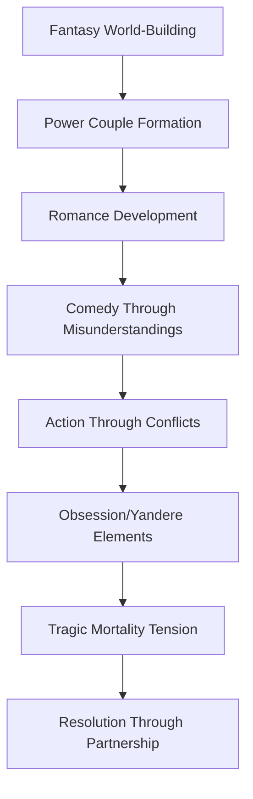
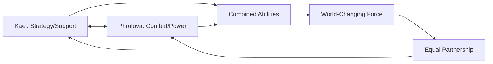

# Design Document

## Overview

**Genre Definition**: Fantasy Power Couple Romance with Tragedy, Obsession, Comedy, and Action elements

This fanfiction novel follows Kael, who retains memories of his past life as a modern office worker but is reborn in the Wuthering Waves world at the same time as Phrolova. Born in the same village as Phrolova in the Ostina region, he grows up with a deep appreciation for music due to the lack of modern entertainment. On the day of the meteor strike that destroys their village, Kael is away in town running errands, witnessing the disaster from afar and rushing back to find the devastation. This shared tragedy creates a deeper connection between him and Phrolova, as he is the only other survivor who truly understands her loss. 

**Power Couple Dynamic**: Both characters are equally powerful and capable, with Phrolova being a formidable Threnodian warrior-musician and Kael developing unique harmonic resonance abilities. Their combined strength makes them a force that can challenge the established order and potentially end the Lament. Neither character is ever dependent on the other for survival or basic competence - they choose to be together because they make each other stronger.

Through their relationship and complementary abilities, they gradually become involved in the larger conflict, ultimately attempting to end the Lament before the main timeline begins.

## Architecture

### Story Structure
The novel follows a detailed multi-act structure spanning 150+ chapters with proper pacing:

**Act I: Origins and the Contrast of Ordinary Dreams vs. Extraordinary Reality (Chapters 1-35)**
- **Beginning**: Kael's reincarnation with past life memories, childhood in merchant family
- **World-Building**: Introduction to basic WuWa world concepts, Resonators, Echoes
- **Ordinary Life Attempts**: Kael desperately tries to maintain normal merchant life despite growing tensions around him
- **Rising Tension**: Increasingly dangerous events occur near him - Tacet Discords, strange resonance phenomena
- **Plot Point 1**: Meeting Phrolova at her concert (mirroring Rover's meeting in the game)
- **Critical Connection**: Kael truly understands her song and sorrow from the very beginning - the thing that keeps her alive
- **External Driving Force**: Concert attacked by Tacet Discords/Fractsidus, forcing both to show their powers publicly
- **Cliche but Necessary**: Power display leads to attention from authorities, Court of Savantae, and other factions
- **Comedy Elements**: Kael's mind constantly seeks ordinary life, yet when crisis hits, he instinctively delivers and helps
- **Character Contrast**: The discrepancy between his desire for normalcy and his natural heroic responses
- **Unintentional Involvement**: Neither wants to save the world, but circumstances keep pulling them deeper
- **Conclusion**: Both awaken resonance abilities after the concert incident, gain unwanted attention from powerful factions

**Act II: Deepening Connection and Escalating Chaos (Chapters 36-60)**
- **Beginning**: Aftermath of concert attack, both trying to return to their previous lives
- **World-Building**: Introduction to Lament effects, Tacet Discords, basic Threnodian lore
- **External Pressure**: Court of Savantae seeks them out, Fractsidus marks them as targets
- **Forced Cooperation**: Circumstances keep throwing them together despite their personal desires
- **Ordinary Life vs. Reality**: Kael continues attempting normal merchant activities while chaos escalates around him
- **Comedy Pattern**: Repeated scenarios where Kael tries to avoid trouble but ends up being the hero
- **Musical Development**: Piano/violin duets where Kael's harmonies acknowledge and honor her sorrow
- **Unintentional Heroics**: They keep accidentally solving problems and gaining reputation
- **Tension**: Neither wants to be heroes, but their actions keep having world-affecting consequences
- **Conclusion**: Major incident forces them into audience with high-ranking officials, making ordinary life impossible

**Act III: Acceptance and Obsession Revelation (Chapters 61-95)**
- **Beginning**: Kael finally accepts he cannot have ordinary life, begins traveling with Phrolova
- **World-Building**: Detailed exploration of Fractsidus, Court of Savantae, Threnodian society
- **Plot Point 1**: Introduction of canon characters (Yangyang, Chixia, Baizhi)
- **Phrolova's Obsession Arc**: Revelation of her true goal - reviving her villagers' resonances into living beings
- **Kael's Dilemma**: Can his abilities help her achieve this "true paradise" or should he help her move on?
- **Phrolova's Yandere Development**: Subtle possessiveness, keeping other girls away from Kael
- **Romance Focus**: Pure love story development, musical harmony as metaphor
- **Character Growth**: Kael stops fighting his destiny but still maintains his caring, ordinary-person perspective
- **Tension**: Kael's growing feelings AND Phrolova's dangerous obsession with the past
- **Conclusion**: First major resurrection attempt using combined abilities, hints that his powers might actually help

**Act IV: The Eye of the Storm and Rover Encounter (Chapters 86-115)**
- **Beginning**: Kael realizes trouble follows him wherever he goes
- **World-Building**: Deep dive into Lament mechanics, Past Rover's history, Calament
- **Plot Point 1**: Meeting with the Rover (current timeline) - the original MC
- **Rover Characterization**: Cold, calculating, goal-oriented - exactly like Past Rover with single focus on ending the Lament
- **Contrast**: Rover's ruthless efficiency vs. Kael and Phrolova's emotional, personal approach
- **Revelation**: Rover explains the true scope of the Lament threat and why personal desires are "irrelevant"
- **Moral Conflict**: Rover's methods work but require sacrificing personal connections and happiness
- **Character Development**: Kael finally abandons dream of ordinary life but refuses to become like Rover
- **Origin Investigation**: Beginning to question the true nature of his isekai experience
- **Phrolova's Obsession Crisis**: Attempts to revive villagers using combined abilities with Kael
- **Rover's Judgment**: Views their emotional attachment as weakness that will lead to failure
- **Tension**: Can they find a third path between ordinary life and Rover's cold efficiency?
- **Conclusion**: Commitment to preventing the Lament their own way, rejecting Rover's emotionless approach

**Act V: Rising Darkness and Hidden Truths (Chapters 116-135)**
- **Beginning**: Active involvement in major WuWa conflicts
- **World-Building**: Fractsidus inner workings, The Architect's true plans
- **Plot Point 1**: Discovery of Phrolova's immortality, Kael begins distancing himself
- **Origin Revelation**: Major plot twist about Kael's true nature and isekai circumstances revealed
- **5W1H Explanation**: Who sent him, What he really is, When/Where/Why the transfer occurred, How it was accomplished
- **Phrolova's Desperation**: Yandere traits peak as she senses Kael pulling away and learns his true nature
- **Tension**: Love vs. mortality vs. true identity, time running out
- **Conclusion**: The Architect's temptation - extending Kael's life through dark means, but now with knowledge of his true origin

**Act VI: Tragic Choices and Ultimate Obsession (Chapters 136-150)**
- **Beginning**: Phrolova's internal struggle with The Architect's offer
- **The Architect's Temptation**: Promises both the power to revive her villagers AND extend Kael's mortal life - the perfect trap
- **Obsession Culmination**: Phrolova's obsession has fully transferred from her dead villagers to living Kael
- **Plot Point 1**: Phrolova's temporary fall to Fractsidus, believing she can achieve both goals
- **Kael's Choice**: Accept her obsessive love and the dark path, or help her find a healthier resolution
- **Tension**: Can love overcome corruption? Can Kael save both Phrolova and the world? Can obsession become healthy devotion?
- **Conclusion**: Final confrontation with the Lament using harmonic opposition abilities, resolution of the obsession arc

**Act VII: Resolution and New Dawn (Chapters 151+)**
- **Beginning**: Aftermath of Lament resolution
- **Plot Point 1**: New timeline establishment, consequences explored
- **Conclusion**: Resolution of immortality conflict, future of their relationship

### Genre Integration Framework


### Power Couple Dynamic Framework


## Components and Interfaces

### Main Characters

#### Kael (Original MC - Power Couple Co-Protagonist)
- **Surface Background**: Appears to be reincarnated with modern memories, born to traveling merchants in Ostina region
- **Hidden Origin**: [PLOT TWIST] True nature to be revealed through story progression - connection to the Lament itself
- **Age**: Same as Phrolova (grows up parallel to her)
- **Musical Background**: Learned piano due to lack of modern entertainment, develops it into a combat and support art
- **Personality**: Cautious but empathetic, wants ordinary life but has gaming sense to recognize "main characters"
- **Comedy Elements**: His modern world knowledge often leads to humorous misunderstandings and anachronistic solutions
- **Unique Ability**: "Resonance Harmony" - abilities that complement yet tragically oppose Phrolova's, specializes in support and battlefield control
- **Power Couple Dynamic**: Strategic thinker and support specialist who enables Phrolova's combat prowess while having his own formidable abilities
- **Character Arc**: From wanting ordinary life to discovering his true purpose and accepting his role as equal partner in changing fate
- **Never Dependent**: While he may not be as physically powerful as Phrolova, his unique abilities and modern knowledge make him indispensable
- **Tragedy Elements**: His mortality creates the central tragic tension, but never makes him weak or helpless
- **Origin Mystery**: The truth about his isekai experience becomes central to understanding how to end the Lament

#### Phrolova Integration (Power Couple Co-Protagonist)
- **Background**: Born in Ostina region, village destroyed by Threnodians (canon), becomes wandering warrior-musician
- **Combat Abilities**: Formidable Threnodian with violin-based combat techniques, can manipulate sound waves as weapons
- **Timeline**: Parallel childhood to Kael, encounters him during her wandering period
- **Personality**: Melancholic but fierce, becomes interested in Kael ONLY because he truly understands her song and sorrow - the very thing that keeps her alive
- **Critical Need**: Her sorrow and music are what sustain her existence; Kael's understanding of this is what draws her to him
- **Musical Connection**: Violin player who finds harmony with Kael's piano, their duets have supernatural resonance effects that can affect reality
- **Power Couple Dynamic**: Equal partner in all conflicts, often takes the lead in combat situations while Kael provides support and strategy
- **Primary Obsession Arc**: Initially obsessed with reviving her villagers' resonances into truly living beings - her driving motivation
- **Obsession Evolution**: Through Kael's influence, gradually shifts from obsession with the dead past to obsession with protecting their living future
- **Yandere Development**: Shows possessive tendencies through strategic manipulation and intimidation, uses her fearsome reputation to keep rivals away
- **Comedy Elements**: Her attempts at subtle jealousy often backfire in humorous ways due to her direct Threnodian nature
- **Pure Love Focus**: Despite obsessive traits, her love remains genuine and protective rather than destructive
- **Role**: Co-protagonist and primary love interest who initiates the relationship, equal partner in all major decisions
- **Character Growth**: From obsession with reviving the dead to accepting loss and focusing on protecting the living (specifically Kael)
- **Threnodian Connection**: Her immortality and unique abilities make her invaluable in understanding and combating the Lament
- **Fractsidus Arc**: Tempted by The Architect who promises both the power to revive her villagers AND extend Kael's life
- **Never Dead Weight**: Always contributes meaningfully to conflicts, often saving Kael as much as he saves her
- **Obsession Transfer**: The story explores whether Kael can help her create a "true paradise" or if he becomes her new obsession

#### Canon Character Integration
- **The Rover**: The original MC - cold, calculating, exactly like Past Rover with single-minded focus on ending the Lament
  - Views emotional attachments as weakness and obstacles to success
  - Serves as foil to Kael and Phrolova's emotional approach
  - Represents the path of sacrificing personal happiness for "greater good"
  - Critical meeting point that forces them to choose their own path
- **Yangyang**: Early ally who helps Kael understand Resonator abilities, potential romantic rival (triggers Phrolova's yandere side)
- **Chixia**: Provides connection to Jinzhou's patrol system, another potential trigger for Phrolova's possessiveness
- **Baizhi**: Medical expertise during Kael's power awakening, professional relationship
- **Scar**: Primary Fractsidus antagonist, represents the path Phrolova might take
- **The Architect**: Ultimate tempter, offers Phrolova the power to extend Kael's life
- **Crownless**: Major echo-based challenge that tests their combined abilities
- **Threnodians**: Various encounters that build understanding of Phrolova's nature and the Lament

### Power System Design

#### Resonance Harmony Ability
Kael's unique power creates a tragic complement to Phrolova's abilities:
1. **Life Resonance**: Can amplify and stabilize life frequencies (opposite to Phrolova's connection to death/sorrow)
2. **Harmonic Synthesis**: Creates harmony between conflicting resonances (complements her discordant melodies)
3. **Temporal Stabilization**: Can anchor moments in time (tragically cannot extend his own mortal lifespan)
4. **Echo Purification**: Can cleanse corrupted echoes (while Phrolova's music often carries tragic memories)
5. **Lament Counterpoint**: His abilities can theoretically counter the Lament's chaos through harmonic opposition

#### Power Limitations
- **Physical Strain**: Synthesizing multiple Echoes causes severe fatigue
- **Emotional Overflow**: Absorbing Echo memories can cause temporary personality shifts
- **Resonance Backlash**: Failure can damage his own frequency permanently
- **Learning Curve**: Requires extensive practice and understanding

## Data Models

### Character Relationship Matrix
```
Kael ←→ Phrolova (Romance/Catalyst)
Kael ←→ Yangyang (Mentor/Ally)
Kael ←→ Chixia (Friend/Support)
Kael ←→ Baizhi (Medical Support)
Kael ←→ Scar (Antagonist)
Phrolova ←→ Canon Characters (Historical connections)
```

### World State Tracking and Lore Integration
- **Timeline Markers**: Key events that must occur before main WuWa 1.0 story
- **Location Status**: Ostina region, Jinzhou, Dim Forest, Court of Savantae territories
- **Lament Mechanics**: Detailed exploration of how the Lament affects reality and time
- **Threnodian Society**: Their role in the world, relationship with humans, immortality aspects
- **Tacet Discord Events**: Regular occurrences that shape the world and character development
- **Fractsidus Operations**: Their goals, methods, and how they recruit members like Phrolova
- **Calament Research**: The substance that might extend human life, central to The Architect's temptation
- **Echo Distribution**: Available Echoes and their current states, how they relate to the Lament
- **Resonator Abilities**: How different types work, why Kael's are unique
- **Court of Savantae**: Their role in maintaining order and fighting the Lament
- **Isekai Mechanism**: The true system behind dimensional transfers, who controls it, and why
- **Origin Mysteries**: Hidden connections between Kael's world and the WuWa universe
- **Lament Connection**: How Kael's origin ties directly to the Lament's existence and potential resolution

### Story Beats Framework
1. **Inciting Incident**: Phrolova's performance awakens Kael's abilities
2. **First Plot Point**: Decision to help Phrolova with her quest
3. **Midpoint**: Discovery of the Lament's true nature
4. **Second Plot Point**: Realization that he can succeed where Past Rover failed
5. **Climax**: The attempt to end the Lament
6. **Resolution**: New timeline and relationship conclusion

## Error Handling

### Canon Consistency Checks
- **Character Behavior Validation**: Ensure all canon characters act within established parameters
- **Timeline Integrity**: Verify all events occur before main story without contradictions
- **Lore Compliance**: Cross-reference all world-building elements with established WuWa lore

### Relationship Development Pacing
- **Romance Progression**: Ensure Kael and Phrolova's relationship develops naturally
- **Power Growth**: Balance ability development to avoid overpowered protagonist
- **Stakes Escalation**: Maintain tension without making challenges insurmountable

### Plot Hole Prevention
- **Motivation Clarity**: Every character action must have clear, understandable motivation
- **Consequence Tracking**: All major decisions must have appropriate consequences
- **Foreshadowing Integration**: Plant early hints for later revelations

## Testing Strategy

### Character Consistency Testing
- Review each character's dialogue and actions against their established personality
- Verify character growth arcs are complete and satisfying
- Ensure romantic development feels authentic and earned

### Plot Logic Validation
- Trace cause-and-effect chains throughout the story
- Verify all setup elements have proper payoff
- Confirm the ending logically follows from established rules and character growth

### Canon Compliance Review
- Cross-reference all WuWa lore elements for accuracy
- Verify timeline placement doesn't contradict established events
- Ensure new elements (like Echo Synthesis) fit within established power systems

### Reader Engagement Metrics
- Chapter-by-chapter pacing analysis
- Tension and release pattern evaluation
- Character likability and relatability assessment
- Emotional impact measurement for key scenes

## Implementation Considerations

### Chapter Structure
- **Target Length**: 2,500-3,500 words per chapter (to accommodate 100+ chapter structure)
- **POV**: Third person limited, primarily from Kael's perspective with occasional Phrolova POV for key emotional moments
- **Pacing**: Slower build-up in early acts, accelerating tension in later acts
- **Musical Themes**: Each act incorporates musical motifs that reflect the emotional state and plot progression
- **Cliffhangers**: End chapters with hooks, particularly focusing on relationship developments and power revelations

### Dialogue Style and Genre Integration
- **Kael**: Modern sensibilities creating comedy through anachronisms, strategic mind in action scenes, vulnerable in romantic moments
- **Phrolova**: Poetic and melancholic but fierce in combat, awkwardly possessive in comedy scenes, passionate in romance
- **Power Couple Banter**: Equal exchanges where both characters contribute meaningfully, no one-sided rescuing
- **Comedy Elements**: Misunderstandings from cultural differences, Phrolova's direct approach to jealousy, Kael's modern solutions to fantasy problems
- **Action Dialogue**: Coordinated battle communication showing their partnership, tactical discussions as equals
- **Romantic Dialogue**: Mutual vulnerability and strength, neither character diminished by love
- **Tragic Elements**: Conversations about mortality and time, the weight of their choices
- **Canon Characters**: Match established speech patterns while reacting to the power couple dynamic

### Scene Construction
- **Setting Descriptions**: Vivid but concise, focusing on atmosphere
- **Action Sequences**: Clear choreography, emphasize stakes and consequences
- **Emotional Scenes**: Deep POV to connect readers with character feelings
- **Transition Management**: Smooth flow between scenes and chapters
## 
Origin Mystery and Isekai Mechanism Design

### The 5W1H Framework for Kael's True Origin

#### WHO: The Entity Behind the Transfer
- **Surface Level**: Appears to be random isekai occurrence
- **Hidden Truth**: Orchestrated by [ENTITY TO BE DETERMINED] - possibly connected to the Lament itself, Past Rover, or an unknown force
- **Revelation Timing**: Mid to late story, creates major plot twist

#### WHAT: Kael's True Nature
- **Surface Level**: Ordinary office worker reincarnated with memories
- **Hidden Truth**: [PLOT TWIST] - Possibly a fragment of Past Rover's consciousness, a Lament-created entity, or something else entirely
- **Implications**: His abilities aren't just unique - they're specifically designed for ending the Lament

#### WHEN: Timing of the Transfer
- **Surface Level**: Died in modern world, reborn as baby in WuWa world
- **Hidden Truth**: Transfer occurred at a specific moment tied to Lament events or Past Rover's actions
- **Timeline Significance**: The timing wasn't random - it was calculated for maximum impact

#### WHERE: Origin Points
- **Departure Point**: Modern Earth (but was it really Earth, or something else?)
- **Arrival Point**: WuWa world, specifically positioned to encounter Phrolova
- **Hidden Connections**: Possible dimensional overlap or shared origin between worlds

#### WHY: The Purpose
- **Surface Level**: Accident or random cosmic event
- **Hidden Truth**: Specific mission or purpose - to succeed where Past Rover failed
- **Deeper Motivation**: The entity behind the transfer has stakes in ending the Lament

#### HOW: The Mechanism
- **Surface Level**: Unexplained supernatural occurrence
- **Hidden Truth**: Sophisticated dimensional transfer system, possibly using Lament energy itself
- **Technical Details**: Connection to resonance frequencies, echo manipulation, or temporal mechanics

### Plot Twist Integration Timeline

#### Early Hints (Acts I-III)
- Subtle inconsistencies in Kael's memories
- Unusual resonance patterns that don't match normal isekai explanations
- Strange reactions from certain characters or entities
- Dreams or visions that don't align with his supposed past life

#### Building Suspicion (Act IV)
- Meeting with Rover triggers deeper questions
- Investigation into his own abilities reveals anomalies
- Discovery of records or evidence that contradict his assumed origin
- Phrolova begins noticing inconsistencies

#### Major Revelation (Act V)
- Full truth about his origin revealed through dramatic confrontation or discovery
- Explanation of the 5W1H framework through dialogue, flashbacks, or exposition
- Impact on his relationship with Phrolova and his role in the story
- New understanding of his abilities and their true purpose

#### Consequences and Resolution (Acts VI-VII)
- How the truth changes his approach to ending the Lament
- Phrolova's reaction to learning his true nature
- Using knowledge of his origin to achieve what Past Rover could not
- Resolution of the mystery and its implications for their future

### Mystery Elements to Develop
- **False Memories**: Some of his "modern world" memories might be implanted or fabricated
- **Ability Source**: His powers come from his true origin, not from being isekai'd
- **Destined Meeting**: His encounter with Phrolova wasn't chance - it was orchestrated
- **Hidden Watchers**: Entities observing his progress and development
- **True Mission**: His real purpose goes beyond just ending the Lament#
# Phrolova's Obsession Arc - Detailed Development

### Phase 1: Hidden Obsession (Act I)
- **Surface Behavior**: Appears to be a melancholic wandering musician performing concerts
- **Hidden Truth**: Every performance, every song is an attempt to call back the resonances of her dead villagers
- **Musical Clues**: Her violin pieces contain fragments of her villagers' life frequencies
- **Survival Mechanism**: Her sorrow and music are literally what keep her alive - without them, she would fade away
- **Concert Meeting**: Kael attends her concert (mirroring Rover's meeting in the game)
- **Meeting Kael**: Initially drawn to him NOT because of his abilities, but because he truly understands and acknowledges her sorrow from the very first hearing
- **Rare Understanding**: Most people either pity her, fear her, or try to "cheer her up" - Kael is the first to truly comprehend the depth and necessity of her grief
- **Kael's Response**: Despite wanting ordinary life, he cannot ignore her pain and instinctively offers genuine understanding

### Phase 2: Revelation and Hope (Act III)
- **Obsession Revealed**: Phrolova confesses her true goal to Kael - she wants to revive her villagers as truly living beings
- **Kael's Dilemma**: His "Resonance Harmony" abilities might actually make this possible
- **Moral Questions**: Is it right to bring back the dead? Are they truly alive or just echoes?
- **Growing Dependency**: Phrolova becomes increasingly reliant on Kael's abilities for her resurrection project
- **First Attempts**: Small successes that fuel her obsession - brief moments where villager resonances seem almost alive

### Phase 3: Obsession Crisis (Act IV)
- **Major Attempt**: Using their combined abilities, Phrolova and Kael attempt a large-scale resurrection
- **Potential Outcomes**:
  - **Partial Success**: Villagers return but as hollow echoes, not truly alive
  - **Catastrophic Failure**: The attempt backfires, causing more harm than good
  - **Moral Revelation**: Kael realizes the villagers don't want to return - they're at peace
- **Breaking Point**: Phrolova must confront the reality that her obsession might be selfish
- **Kael's Role**: Does he enable her obsession or help her find resolution?

### Phase 4: Obsession Transfer (Act V)
- **Letting Go**: Phrolova begins to accept that her villagers are gone
- **New Focus**: Her obsessive nature doesn't disappear - it transfers to protecting Kael
- **Yandere Intensification**: As she lets go of the past, she becomes more possessive of her future with Kael
- **Healthy vs. Unhealthy**: The story explores whether this transfer is growth or just redirected obsession
- **Kael's Mortality**: Learning about his mortal lifespan triggers a new crisis

### Phase 5: Ultimate Test (Act VI)
- **The Architect's Perfect Trap**: Offers both her original obsession (revive villagers) AND her new obsession (extend Kael's life)
- **Temptation Mechanics**: Uses her guilt about the villagers and fear of losing Kael
- **Internal Conflict**: Phrolova torn between accepting the dark path or finding a healthier resolution
- **Kael's Choice**: How does he respond to her obsessive love? Enable it or help transform it?

### Resolution Possibilities
- **True Paradise Route**: Kael helps Phrolova create a memorial/sanctuary for her villagers while building a new life together
- **Obsession Resolution**: Phrolova learns to love without obsession, channeling her intensity into their partnership
- **Healthy Devotion**: Her obsessive nature transforms into fierce but healthy devotion to their shared goals
- **Acceptance**: She finds peace with loss while maintaining her passionate nature in a positive way

### Key Questions to Explore
1. Can Kael actually help revive the villagers, and should he?
2. Is Phrolova's obsession with the past preventing her from living in the present?
3. How does her obsession transfer from the dead to the living (Kael)?
4. Can obsessive love become healthy devotion, or must it be completely overcome?
5. What role does Kael play - enabler, healer, or something else?
6. How does this obsession arc tie into the larger plot of ending the Lament?

### Thematic Elements
- **Grief and Acceptance**: Learning to let go of the past
- **Love vs. Obsession**: The fine line between passionate love and unhealthy fixation
- **Life and Death**: What it means to truly live vs. merely exist
- **Partnership**: How two people can help each other grow and heal
- **Sacrifice**: What are they willing to give up for each other and the world?## T
he Critical First Meeting - Understanding Sorrow

### Why Kael Can Understand Phrolova's Sorrow

#### Modern World Perspective
- **Emotional Maturity**: His adult experiences from modern life give him deeper emotional understanding
- **Cultural Context**: Modern world's approach to grief and loss provides different perspective than WuWa world's typical responses
- **No Preconceptions**: Unlike others who know her reputation, he encounters her music without bias
- **Empathy Through Experience**: His own sense of displacement and loss (being isekai'd) creates resonance with her grief

#### The Moment of Recognition
- **First Hearing**: When Kael first hears Phrolova's violin, he doesn't try to "fix" her sadness
- **Acknowledgment**: He recognizes that her sorrow is not something to be cured, but something to be honored
- **Musical Response**: His piano doesn't try to make her music "happy" - it harmonizes with the sadness, validating it
- **Emotional Truth**: He understands that her grief is part of her identity and strength, not a weakness

#### What Others Get Wrong
- **Pity**: Most people feel sorry for her, which she finds condescending
- **Fear**: Some are afraid of her melancholic music and its effects
- **False Comfort**: Others try to cheer her up or tell her to "move on"
- **Misunderstanding**: They don't realize her sorrow is literally what keeps her alive as a Threnodian

#### What Kael Gets Right
- **Validation**: He acknowledges her pain as real and important
- **Respect**: He treats her sorrow as sacred, not something to be dismissed
- **Understanding**: He grasps that her music is both expression and survival mechanism
- **Harmony**: His musical response complements rather than contradicts her emotional state
- **Patience**: He doesn't rush to "fix" her or change her fundamental nature

### The Life-Sustaining Nature of Sorrow

#### Threnodian Physiology
- **Emotional Fuel**: Her sorrow literally powers her existence
- **Musical Manifestation**: The violin music is how she processes and channels this life force
- **Dangerous Balance**: Too little sorrow and she fades; too much and she becomes destructive
- **Unique Burden**: She must maintain her grief to survive, making healing complicated

#### Kael's Role
- **Witness**: He becomes someone who can witness her sorrow without trying to take it away
- **Harmonizer**: His abilities can help her channel her grief more effectively
- **Understanding Partner**: He accepts that her sadness is part of who she is
- **Growth Catalyst**: Through his understanding, she can explore new ways to express and channel her sorrow

This understanding becomes the foundation of their entire relationship - he doesn't love her despite her sadness, he loves her including her sadness, recognizing it as an essential part of who she is.##
 The Concert Meeting - Mirroring the Game

### Setting the Scene
- **Location**: Public concert venue where Phrolova performs
- **Atmosphere**: Melancholic, haunting music that affects the audience deeply
- **Kael's Intention**: Attending as part of his attempt at normal social activities
- **Expectation vs. Reality**: He expects simple entertainment but encounters profound sorrow

### The Moment of Recognition
- **Musical Impact**: Phrolova's violin music hits Kael differently than other audience members
- **Emotional Resonance**: He immediately understands that her sorrow is not performance but survival
- **Instinctive Response**: Despite wanting to avoid "main character" situations, he cannot ignore her pain
- **Post-Concert Approach**: He approaches her not as a fan but as someone who truly heard her message

### Kael's Internal Conflict Pattern
- **Ordinary Life Desire**: "I just want to be a normal merchant"
- **Reality Check**: Supernatural events keep happening around him
- **Crisis Response**: When trouble hits, he instinctively helps despite his intentions
- **Post-Crisis Rationalization**: "That was just a one-time thing, I can still be normal"
- **Comedy Element**: The repeated cycle of denial and heroic action

### Examples of the Pattern
1. **Tacet Discord Attack**: Kael tries to hide, ends up saving civilians
2. **Resonance Phenomenon**: Attempts to ignore it, ends up investigating to help others
3. **Phrolova's Concert**: Goes for normal entertainment, ends up making deep emotional connection
4. **Dangerous Situations**: Always tries to avoid them, always ends up in the middle helping

### The Contrast Theme
- **Mind**: Constantly planning ordinary merchant activities
- **Heart**: Cannot ignore suffering or injustice
- **Actions**: Consistently heroic despite mental resistance
- **Growth**: Gradually accepting that his nature doesn't match his desires
- **Comedy**: The absurdity of someone trying so hard to be ordinary while being extraordinary

This pattern becomes a running theme throughout Act I, building to the point where Kael can no longer deny his involvement in the larger story.#
# External Driving Forces - The Unintentional Path to World-Saving

### Neither Wants to Save the World
- **Kael's Goal**: Live ordinary merchant life, avoid "main character" situations
- **Phrolova's Goal**: Survive through her sorrow, eventually revive her villagers
- **Shared Desire**: Personal happiness and peace, not heroic destiny

### Driving Forces That Pull Them In

#### Coincidental Events
1. **Concert Attack**: Tacet Discord/Fractsidus attack during Phrolova's performance
2. **Power Display**: Forced to reveal abilities to save civilians
3. **Unwanted Attention**: Authorities notice their unique resonance combination
4. **Escalating Incidents**: Each attempt to return to normal life triggers bigger events

#### Intentional Manipulation
1. **Court of Savantae**: Seeks to recruit them for their unique abilities
2. **Fractsidus**: Targets them as threats or potential recruits
3. **The Architect**: Manipulates events to test and eventually tempt them
4. **Hidden Forces**: Entities connected to Kael's true origin orchestrating encounters

#### Cliche but Necessary Plot Devices
1. **Public Power Display**: Concert attack forces them into spotlight
2. **Authority Summons**: Brought before Court of Savantae officials
3. **Escalating Threats**: Each resolved crisis leads to bigger problems
4. **Reputation Building**: Unintentional heroics create expectations
5. **Faction Interest**: Multiple groups want to use their abilities
6. **No Escape**: Attempts to flee or hide only create more problems

### The Rover Encounter - Detailed Development

#### Rover's Character (Original MC)
- **Personality**: Cold, calculating, emotionally detached
- **Goal**: End the Lament at any cost, views personal desires as obstacles
- **Methods**: Ruthlessly efficient, willing to sacrifice individuals for greater good
- **Past**: Exactly like Past Rover - has already sacrificed personal connections
- **View of Kael/Phrolova**: Sees their emotional bond as weakness that will cause failure

#### The Meeting Context
- **Setting**: Formal encounter arranged by Court of Savantae or forced by crisis
- **Rover's Purpose**: Evaluate their potential, possibly recruit or eliminate them
- **Information Exchange**: Rover explains true scope of Lament threat
- **Philosophical Conflict**: Emotional approach vs. cold efficiency

#### Key Dialogue Themes
- **Rover**: "Personal attachments are luxuries the world cannot afford"
- **Kael**: "What's the point of saving a world where no one can be happy?"
- **Rover**: "I've seen what happens when people choose love over duty"
- **Phrolova**: "Your way saves the world but kills the soul"

#### Consequences of the Meeting
1. **Reality Check**: Forces them to understand the true stakes
2. **Path Rejection**: They refuse to become emotionally detached like Rover
3. **Third Option**: Seek to find a way that preserves both world and relationships
4. **Increased Pressure**: Rover's disapproval adds another external force
5. **Character Growth**: Solidifies their commitment to their own approach

### The Escalation Pattern
1. **Small Incident**: Try to help locally, accidentally solve bigger problem
2. **Attention**: Success brings unwanted notice from powerful factions
3. **Bigger Crisis**: Forced to handle larger threats due to reputation
4. **No Retreat**: Each attempt to step back creates vacuum that causes more problems
5. **Inevitable Involvement**: Eventually realize they're too deep to escape

### Unintentional Consequences
- **Reputation**: Become known as powerful duo despite not wanting fame
- **Expectations**: People expect them to solve increasingly difficult problems
- **Target Status**: Both allies and enemies see them as important pieces
- **Responsibility**: Their unique abilities make them irreplaceable for certain crises
- **Moral Obligation**: Cannot ignore suffering they have power to prevent

This creates a natural progression where two people who just want personal happiness are gradually forced into world-saving roles through external circumstances rather than internal heroic desires.
##
 Corrected Central Theme

**The Real Conflict**: Can they keep their ordinary life while not dying trying to survive in this fucked up world?

This is the true heart of the story - not grand heroic ambitions or moral dilemmas about saving humanity, but the simple, relatable struggle of two people who just want to live peacefully but keep getting dragged into increasingly dangerous situations by circumstances beyond their control. 

The world of Wuthering Waves is genuinely dangerous and chaotic, and their unique abilities make them targets whether they want to be heroes or not. The question becomes: how do you maintain your humanity, your relationships, and your personal desires when the world keeps trying to kill you and everyone expects you to fix everything?

This framing makes their eventual involvement in ending the Lament feel organic - not because they chose to be heroes, but because they literally cannot survive in the current world without addressing the root cause of all the chaos that keeps threatening their attempts at ordinary happiness.